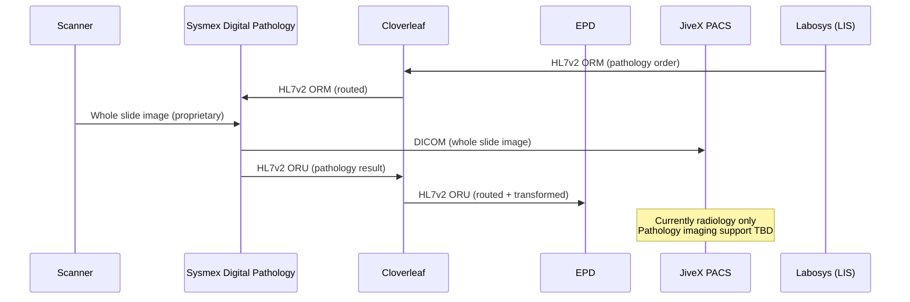
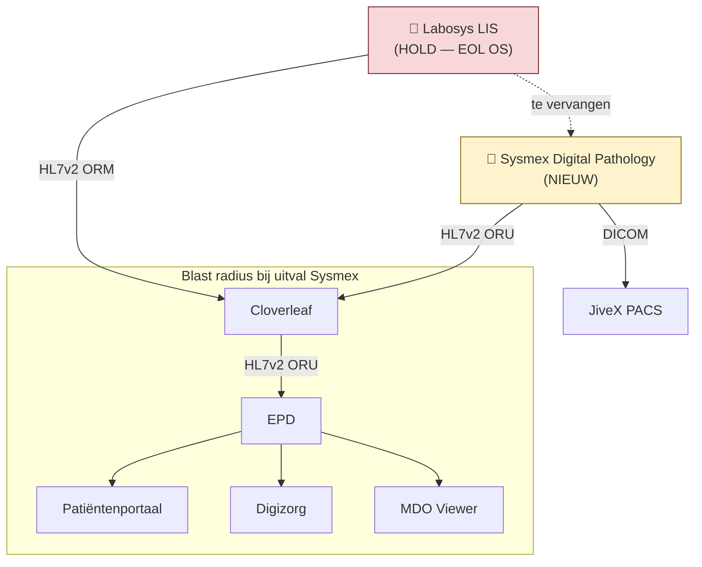
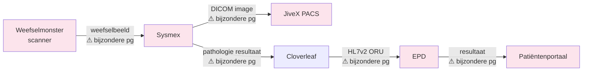

# Worked Example: Digital Pathology from Sysmex

This walks through a complete Preflight assessment end-to-end. Every step, every persona output, every product generated — for a real-world scenario.

---

## The Request

A pathologist and the lab manager approach the IT department:

> "We want Digital Pathology from Sysmex. Whole slide imaging for tissue samples. The pathologists are ready to go digital."

That's it. One sentence. This is what the architect receives today and spends 2-3 weeks turning into a board-ready PSA.

With Preflight: the architect pastes this sentence and attaches the Sysmex product brochure PDF.

---

## Step 0 — Ingest

Preflight generates targeted landscape queries based on what each persona needs to know:

**ArchiMate queries** (automatic):
- Thomas: "Application components in bedrijfsfunctie Diagnostiek, specifically pathology/histologie capability space" → Finds: legacy pathology module in LIS (Labosys), lifecycle status: HOLD on tech radar
- Lena: "Serving/flow/triggering relationships touching LIS, PACS, EPD in pathology context" → Finds: Labosys → Cloverleaf (HL7v2 ORM/ORU) → EPD, JiveX PACS serving radiology (not pathology)
- CMIO: "Clinical interfaces: HL7v2/FHIR/DICOM connections in diagnostics domain" → Finds: 14 HL7v2 interfaces through Cloverleaf in diagnostics, no FHIR endpoints, DICOM connections to JiveX for radiology only

**TOPdesk queries** (automatic):
- Jan: "CIs related to LIS, pathology systems, DR status" → Finds: Labosys CI, DR tier 2 (RPO 4h, RTO 4h), hosted on-prem VMware cluster
- Victor: "Open security risks, pen test findings for diagnostics systems" → Finds: 1 open finding — Labosys runs on end-of-support OS

**SharePoint queries** (automatic):
- Marcus: "Previous ADRs for pathology, diagnostics, imaging systems" → Finds: ADR-2023-041 "PACS consolidation — JiveX as strategic imaging platform"

**LeanIX queries** (automatic):
- Thomas: "Labosys application record" → Finds: business criticality HIGH, technology risk HIGH, planned retirement Q3 2027

**Output**: Landscape Context Brief injected into every persona's `history` field.

---

## Step 1 — Classify

```
Type: clinical-system
Impact: high
Regulatory triggers: patient data (tissue samples, pathology reports)
```

**Selected personas** (via `selectRelevant('clinical-system', { includeRedTeam: true })`):
CIO, CMIO, Marcus, Thomas, Lena, Aisha, Victor, CISO, ISO-Officer, Nadia, FG-DPO, PO, Raven

**Triage floor applied**: `clinical-system` → minimum standard review, CMIO always active, cannot be fast-tracked.

---

## Step 2 — Retrieve

Per-persona knowledge bundles from the embedded knowledge base:

| Persona | Retrieved chunks |
|---------|-----------------|
| CMIO | IVDR classification criteria for digital pathology, IEC 62304 software lifecycle requirements for SaMD, FHIR DiagnosticReport resource spec |
| Victor | NEN 7510 A.14 (system acquisition security), STRIDE threat model template, hospital security baseline for clinical systems, DICOM security profile |
| Nadia | AIVG Module ICT — SaaS clauses + exit requirements, IVDR/MDR regulatory applicability, NEN 7512 trust level requirements for clinical data exchange |
| FG-DPO | AVG Article 9 — processing bijzondere persoonsgegevens (gezondheidsgegevens), DPIA triggers for systematic clinical data processing, verwerkingsgrondslag options for clinical diagnostics |
| Thomas | Tech radar current positions, application lifecycle policy, previous vendor assessments for diagnostic imaging |
| Aisha | Data classification scheme for pathology (tissue images = bijzondere persoonsgegevens), DPIA template for clinical imaging systems |
| Lena | Integration patterns for diagnostic imaging, Cloverleaf routing standards, HL7v2 ORU message spec for pathology results |

---

## Step 3 — Assess (Deep Mode — high impact)

Each persona gets its own LLM call with their context bundle and landscape brief.

### CIO Assessment

**Rating: CONDITIONAL**

> This advances the digital diagnostics strategy and aligns with the Labosys retirement roadmap (planned Q3 2027 per LeanIX). The timing is right. However: Sysmex is a new vendor to this hospital — we have no existing relationship, no verwerkersovereenkomst, no AIVG baseline. TCO must include: license, storage (whole slide images are 1-3 GB each), integration, training, and the Labosys retirement cost. Who maintains this in year two? What do we stop doing to fund this?
>
> **Conditions**: TCO analysis including storage growth model. Staffing plan for transition period. Vendor consolidation analysis — can JiveX (strategic PACS platform per ADR-2023-041) serve pathology imaging instead of adding a new vendor?

### CMIO Assessment

**Rating: CONDITIONAL**

> Digital pathology fundamentally changes the pathologist's workflow — from microscope to screen. Clinical validation is mandatory: has Sysmex demonstrated diagnostic equivalence between digital and traditional microscopy for the tissue types our pathologists handle? IVDR classification: this is likely a Class C IVD medical device (in-vitro diagnostic, high individual risk). IEC 62304 software lifecycle applies.
>
> Pathology results must flow to the EPD via Cloverleaf. Current HL7v2 ORU messages from Labosys carry structured results. Whole slide images are a different beast — DICOM is the standard, but the current JiveX PACS serves radiology. Does Sysmex output DICOM, and can JiveX ingest pathology images alongside radiology?
>
> **Patient safety concern**: If pathologists transition to digital and the system is unavailable (B=3 scenario), there is no quick fallback to traditional microscopy — the slides may already be in the digital workflow. Fallback procedure must be defined before go-live.
>
> **Conditions**: Clinical validation studies demonstrating diagnostic equivalence. IVDR classification determination. Fallback procedure for system unavailability. Cloverleaf integration design for pathology results + DICOM routing for images.

### Marcus (Chief Architect) Assessment

**Rating: CONDITIONAL**

> **ZiRA positioning:**
> - Bedrijfsdomein: Zorg
> - Bedrijfsfunctie: Diagnostiek (pathologische anatomie)
> - Dienst: Diagnostische dienstverlening
> - Processen: Diagnosticeren, Aanvullend onderzoek
> - Informatiedomein: Klinische informatie
> - Applicatiefunctie: Beeldvorming (imaging)
>
> ADR-2023-041 designated JiveX as the strategic imaging platform. Adding Sysmex digital pathology as a separate imaging system contradicts this decision unless the ADR is amended. Marcus insists: either extend JiveX to cover pathology imaging (preferred — ZiRA principle 9 Eenvoudig), or document why a separate system is justified and amend the ADR.
>
> Architecture debt: if Sysmex is approved, Labosys pathology module becomes immediate decommission candidate. This resolves debt item "Labosys end-of-support OS" but creates new debt: "two imaging platforms (JiveX + Sysmex)."
>
> **Principetoets:**
> | Principe | Beoordeling | Toelichting |
> |----------|-------------|-------------|
> | Waardevol | ✓ | Enables digital diagnostics, aligns with strategy |
> | Veilig en vertrouwd | △ | STRIDE needed, IVDR classification pending |
> | Eenvoudig | △ | Second imaging platform violates simplicity unless JiveX extension evaluated |
> | Flexibel | △ | Exit strategy and data portability for whole slide images not assessed |
>
> **Conditions**: Evaluate JiveX extension for pathology before committing to Sysmex as separate platform. Amend ADR-2023-041 if separate platform is justified.

### Thomas (Application) Assessment

**Rating: CONCERN**

> Portfolio overlap: JiveX already serves imaging (strategic per ADR-2023-041). Adding Sysmex = two imaging platforms. LeanIX shows Labosys technology risk HIGH with planned retirement Q3 2027 — so there is a portfolio rationalization opportunity, but only if Sysmex replaces Labosys pathology, not just adds to it.
>
> Tech radar position: Sysmex digital pathology — not on radar (ASSESS needed). Vendor viability: Sysmex is established in lab diagnostics but digital pathology is a newer market for them. Competitor analysis needed: Philips IntelliSite, Leica Aperio, Hamamatsu NanoZoomer.
>
> AIVG Module ICT compliance: not assessed. Exit-clausule for whole slide images critical — these are massive files in proprietary formats. Data return in "gangbaar gestructureerd formaat" — is DICOM the export format? Broncode escrow relevance: unlikely (COTS product), but customizations need assessment.
>
> **Conditions**: Tech radar assessment for Sysmex digital pathology. Vendor viability assessment. Competitor comparison. AIVG Module ICT compliance check. Data portability assessment for whole slide images (can images be exported in DICOM?).

### Victor (Security) Assessment

**Rating: CONDITIONAL**

> **STRIDE threat model (draft — pre-filled from ArchiMate):**
>
> | Threat | Component | Finding |
> |--------|-----------|---------|
> | Spoofing | Pathologist login to Sysmex | Must integrate with Entra ID SSO (no separate credentials) |
> | Tampering | Whole slide images | Image integrity critical for diagnosis — hash verification on storage and retrieval |
> | Repudiation | Diagnostic annotations | Audit trail on all pathologist annotations and measurements |
> | Information Disclosure | Patient tissue images | Bijzondere persoonsgegevens — V=3, encryption at rest and transit mandatory |
> | Denial of Service | Image viewing service | B=3 system — availability architecture needed |
> | Elevation of Privilege | Sysmex admin access | Segregation from hospital network, no vendor remote access without PAM |
>
> Open finding from TOPdesk: Labosys runs on end-of-support OS. If Sysmex integrates with Labosys during transition period, that risk extends to Sysmex.
>
> **Conditions**: Full STRIDE threat model before board. Sysmex must demonstrate NEN 7510 compliance or ISO 27001 certification. SBOM for digital pathology platform. Network segmentation plan for imaging workstation subnet.

### Nadia (Risk & Compliance) Assessment

**Rating: CONDITIONAL**

> **Regulatory applicability:**
> | Regulation | Applies | Detail |
> |-----------|---------|--------|
> | IVDR | Yes | Digital pathology for clinical diagnosis = IVD medical device |
> | NEN 7510 | Yes | Patient data (tissue images, pathology reports) |
> | NEN 7512 | Yes | Clinical data exchange (results to EPD) |
> | NEN 7513 | Yes | Logging access to patient-related diagnostic data |
> | AVG/GDPR | Yes | Bijzondere persoonsgegevens (gezondheidsgegevens) |
> | AIVG 2022 | Yes | New vendor, new product |
>
> AIVG Module ICT checklist (draft — pre-filled):
> - [ ] NEN 7510 compliance / ISO 27001 certification — **not verified**
> - [ ] Verwerkersovereenkomst conform BOZ-model — **not in place**
> - [ ] Exit-clausule with data return — **not assessed**
> - [ ] Broncode escrow — **N/A (COTS), assess customizations**
> - [ ] Hosting within EER — **not confirmed**
> - [ ] 24-maanden versie-ondersteuning — **not confirmed**
> - [ ] SaaS calamiteitenregeling — **not assessed (is this SaaS or on-prem?)**
>
> **Conditions**: Complete AIVG Module ICT checklist with vendor. Verwerkersovereenkomst before go-live. IVDR classification determination before procurement.

### FG-DPO Assessment

**Rating: DRAFT DETERMINATION — pending FG review**

> Tissue samples and pathology images are **bijzondere persoonsgegevens** (gezondheidsgegevens under AVG Article 9). Processing requires an Article 9(2) exception.
>
> Proposed verwerkingsgrondslag: Article 9(2)(h) — processing necessary for medical diagnosis. This is valid if the processing is performed by or under the responsibility of a medical professional bound by medisch beroepsgeheim (WGBO).
>
> **DPIA is mandatory** (AVG Article 35): systematic processing of bijzondere persoonsgegevens at large scale.
>
> **Draft verwerkingsregister entry:**
> | Veld | Inhoud |
> |------|--------|
> | Verwerkingsactiviteit | Digitale pathologie — verwerking weefselbeelden voor diagnostiek |
> | Persoonsgegevens | Weefselbeelden, pathologische bevindingen, patiëntidentificatie |
> | Betrokkenen | Patiënten |
> | Grondslag | Art. 9(2)(h) AVG — medische diagnostiek |
> | Bewaartermijn | Per WGBO: 20 jaar na laatste behandeling |
> | Ontvangers | Pathologen, behandelend artsen (via EPD), Sysmex (als verwerker) |
>
> **Conditions**: DPIA must be completed before go-live. Verwerkersovereenkomst with Sysmex must be in place. FG sign-off on verwerkingsgrondslag required.

### Raven (Red Team) Pre-Mortem

> It's 18 months later. Digital pathology failed. Why?
>
> **Failure mode 1: Storage cost explosion.** Whole slide images are 1-3 GB each. The hospital processes ~15,000 pathology cases per year. That's 15-45 TB of new data annually, growing indefinitely (WGBO 20-year retention). Nobody modeled the storage cost trajectory. After year 2, the CIO asks "why is our storage bill 3x what was projected?" and the project loses funding for the infrastructure it needs.
>
> **Failure mode 2: Pathologist resistance.** The request came from "a pathologist and the lab manager." How many pathologists? If it's 1 out of 8, the other 7 may resist the transition. Digital pathology changes their entire workflow — screen instead of microscope, mouse instead of slide. If adoption is 30%, the hospital maintains both digital and traditional workflows, doubling operational complexity.
>
> **Failure mode 3: JiveX can't do pathology.** Marcus and Thomas both want to evaluate JiveX extension first. But JiveX is a radiology PACS — pathology imaging has different requirements (multi-layer z-stacking, 40x magnification, annotation workflows). If the evaluation takes 3 months and concludes "JiveX can't do it," the project is delayed by a quarter for a foregone conclusion. Ask JiveX upfront — do they support pathology whole slide imaging? A 1-hour vendor call resolves this.
>
> **Failure mode 4: IVDR classification blocks procurement.** Nadia flagged IVDR. If the classification determination takes 6 months (not unusual for regulatory processes), procurement cannot start. The pathologists who were "ready to go digital" lose interest. The regulatory timeline should be the project timeline driver, not the IT timeline.
>
> **What everyone missed:** The transition period. During migration from Labosys to Sysmex, both systems run in parallel. For how long? Who manages two pathology workflows? What if results are split between systems? Nobody assessed the 6-12 month transition state.

---

## Step 4 — Challenge

- **Victor**: CONDITIONAL (not block) — no veto triggered. STRIDE draft provided, conditions for approval are actionable.
- **Nadia**: CONDITIONAL — no escalation. Regulatory applicability clear, AIVG checklist started.
- **FG-DPO**: DRAFT DETERMINATION — requires real FG review. Processing appears lawful under Art. 9(2)(h) but DPIA is mandatory.
- **Raven**: Pre-mortem delivered. Storage cost, pathologist adoption, JiveX evaluation timing, IVDR timeline, and transition state flagged.

---

## Step 5 — Output

### Triage

`determineTriageLevel()`:
- Clinical system → minimum standard review (floor applied)
- CMIO: conditional (patient safety concern on fallback)
- Thomas: concern (portfolio overlap)
- No blocks or vetos
- **Treatment: STANDARD REVIEW** with board prep pack

### Products Generated

| Product | Generated? | Primary Content |
|---------|-----------|----------------|
| PSA | Yes (always) | Full assessment below |
| ADR | Yes (always) | "Digital Pathology platform selection — evaluate JiveX extension vs. Sysmex standalone" |
| Clinical Impact Brief | Yes (clinical-system) | CMIO's assessment: workflow change, fallback procedure, IVDR classification |
| Vendor Assessment | Yes (new vendor) | Sysmex scorecard, tech radar ASSESS, AIVG checklist (incomplete) |
| DPIA | Yes (bijzondere persoonsgegevens) | Draft with verwerkingsregister entry, pending FG sign-off |
| BIA/BIV | Yes (clinical diagnostics = business-critical) | B=3 (CMIO), I=3 (CMIO), V=3 (Victor/Nadia/CMIO) → BIV 3-3-3 |
| Integration Design | Yes (Cloverleaf + PACS) | Draft: pathology results via Cloverleaf, DICOM routing for images |
| Security Assessment | Yes (V=3) | STRIDE draft pre-filled from proposal components |
| Tech Radar Update | Yes (new technology) | "Sysmex Digital Pathology — ASSESS — pending vendor viability and clinical validation" |

### Diagrams Generated

**Integration flow** (Mermaid, embedded in Integration Design):



**Cascade dependencies** (Mermaid, embedded in BIA):



**Landscape position** (draw.io — editable): Sysmex placed in the diagnostics capability area of the hospital's application landscape. Shows existing connections (Labosys, Cloverleaf, JiveX, EPD), proposed new connections, and the Labosys retirement path. The architect opens this in draw.io, adjusts the layout, adds annotations for the board presentation, and exports to PNG.

**Data flow for DPIA** (Mermaid, embedded in DPIA):



Every node handling bijzondere persoonsgegevens is marked. This diagram goes directly into the DPIA — the FG sees exactly where patient data flows and where processing occurs.

### Draft PSA (abbreviated)

```markdown
# Project Start Architectuur: Digitale Pathologie (Sysmex)

## 1. Managementsamenvatting
Triage: STANDAARD REVIEW
Voorstel voor invoering digitale pathologie (whole slide imaging) van Sysmex.
Sluit aan op digitale diagnostiekstrategie en Labosys uitfaseringsplan (Q3 2027).
Belangrijke aandachtspunten: IVDR-classificatie, portfoliooverlap met JiveX (ADR-2023-041),
patiëntveiligheid bij systeemuitval, en opslagkosten voor weefselbeelden.
Advies: beoordeel eerst JiveX-uitbreiding voor pathologie alvorens Sysmex als apart platform.

## 2. Context en Aanleiding
[Business request + landscape context from Step 0]

## 3. ZiRA Positionering
- Bedrijfsdomein: Zorg
- Bedrijfsfuncties: Diagnostiek (pathologische anatomie)
- Diensten: Diagnostische dienstverlening
- Processen: Diagnosticeren, Aanvullend onderzoek
- Informatiedomeinen: Klinische informatie
- Applicatiefuncties: Beeldvorming (imaging)

## 4. Principetoets
| ZiRA Principe | Beoordeling | Toelichting |
|---------------|-------------|-------------|
| Waardevol | ✓ | Versnelt diagnostiek, sluit aan op strategie |
| Veilig en vertrouwd | △ | STRIDE nodig, IVDR-classificatie openstaand |
| Eenvoudig | △ | Tweede beeldvormingsplatform naast JiveX |
| Flexibel | △ | Exitstrategie en dataportabiliteit niet beoordeeld |

## 5. Domeinbeoordelingen
### CIO: VOORWAARDELIJK
[TCO-analyse nodig inclusief opslaggroeimodel...]

### CMIO: VOORWAARDELIJK — patiëntveiligheidsaandachtspunt
[Klinische validatie verplicht, terugvalprocedure bij uitval...]

### Marcus (Chief Architect): VOORWAARDELIJK
[JiveX-uitbreiding evalueren voor committering aan apart platform...]

### Thomas (Applicatiearchitectuur): BEZORGD
[Portfoliooverlap met JiveX, tech radar assessment nodig...]

### Victor (Beveiligingsarchitectuur): VOORWAARDELIJK
[STRIDE dreigingsmodel concept bijgevoegd, NEN 7510 compliance vereist...]

### Nadia (Risico & Compliance): VOORWAARDELIJK
[IVDR, NEN 7510/7512/7513, AIVG Module ICT checklist gestart...]

### FG-DPO: CONCEPT BEOORDELING — wacht op FG-bevestiging
[Art. 9(2)(h) AVG, DPIA verplicht, verwerkingsregisterentry concept...]

## 6. Risicoregister
| Risico | Gesignaleerd door | Ernst | Mitigatie |
|--------|-------------------|-------|-----------|
| Opslagkosten explosie (15-45 TB/jaar) | Raven | Hoog | TCO-model met opslaggroeitrajectie |
| Portfoliooverlap JiveX | Thomas, Marcus | Midden | JiveX-evaluatie voor pathologie |
| Pathologenadoptie onzeker | Raven | Midden | Adoptieonderzoek onder alle pathologen |
| IVDR-classificatie vertraagt inkoop | Nadia, Raven | Hoog | Parallelle start classificatietraject |
| Geen terugval bij uitval | CMIO | Hoog | Terugvalprocedure voor go-live |
| Labosys EOL OS — risico-uitbreiding | Victor | Midden | Netwerksegmentatie tijdens transitie |

## 7. Red Team Bevindingen
[Raven's pre-mortem: storage, adoption, JiveX timing, IVDR timeline, transition state]

## 8. Voorwaarden voor Goedkeuring
1. JiveX-evaluatie voor pathologie beeldvorming (Marcus, Thomas)
2. Klinische validatiestudies diagnostische equivalentie (CMIO)
3. IVDR-classificatiebepaling (Nadia, CMIO)
4. Voltooide STRIDE dreigingsanalyse (Victor)
5. AIVG Module ICT checklist met leverancier (Nadia)
6. DPIA voor go-live (FG-DPO)
7. Verwerkersovereenkomst met Sysmex (FG-DPO)
8. TCO-analyse inclusief opslaggroeimodel (CIO)
9. Terugvalprocedure bij systeemuitval (CMIO, Jan)
10. ADR-2023-041 amenderen indien apart platform (Marcus)

## 9. Open Vragen voor de Board
- Budget: past dit binnen de digitale diagnostiek enveloppe of vereist aanvullende financiering?
- Timing: starten we nu met JiveX-evaluatie en Sysmex parallel, of sequentieel?
- Pathologenadoptie: is de gehele pathologiegroep committed, of slechts een deel?
- Strategische keuze: willen we één beeldvormingsplatform (JiveX voor alles) of best-of-breed?

## 10. Bijlagen
- [Klinisch Impactoverzicht](clinical-impact-digital-pathology.md)
- [Leveranciersbeoordeling Sysmex](vendor-assessment-sysmex.md)
- [DPIA Concept](dpia-digital-pathology.md)
- [BIA/BIV](bia-digital-pathology.md)
- [Integratieontwerp Concept](integration-digital-pathology.md)
- [Beveiligingsbeoordeling (STRIDE)](security-digital-pathology.md)
- [Technologieradar Update](techradar-sysmex.md)
```

---

## What Happens Next

1. **Architect reviews**: Spends ~1 hour refining the draft PSA. Adds context from a conversation with the pathology department head. Adjusts the risk register based on knowledge that JiveX vendor already confirmed they don't support pathology.
2. **FG confirms**: Real FG reviews the draft determination. Confirms verwerkingsgrondslag. Requests sub-processor list from Sysmex for verwerkersovereenkomst.
3. **Assessment moves to BOARD-READY**: Added to next board prep pack.
4. **Board reviews**: Sees the one-paragraph summary, BIV 3-3-3 flag, 10 conditions, 4 open questions. Estimated board time: 30 minutes. Decides: approve with conditions. JiveX evaluation to be done first (condition 1) — Marcus owns, due in 4 weeks.
5. **Conditions tracked**: 10 conditions created in Preflight. Owners assigned. Due dates set.
6. **Delta re-assessment**: 6 weeks later, JiveX evaluation complete (they don't support pathology). Marcus amends ADR-2023-041. Architect marks the change. Preflight re-evaluates Marcus and Thomas only. v2 assessment: separate platform justified.
7. **Vendor intelligence**: Sysmex profile created. AIVG status, NEN 7510 status, verwerkersovereenkomst status tracked. Next time Sysmex appears in a proposal, full history is there.
8. **Architecture debt**: Debt item created: "Two imaging platforms (JiveX radiology + Sysmex pathology) — evaluate convergence at JiveX contract renewal (2028)."

---

## Time Comparison

| Activity | Without Preflight | With Preflight |
|---------|-------------------|----------------|
| Landscape research | 2-3 days | 30 seconds (automated ArchiMate/TOPdesk/LeanIX queries) |
| ZiRA positioning | 2-4 hours | Pre-filled (architect verifies in 10 minutes) |
| Domain assessments | 1-2 weeks (scheduling meetings with each domain) | 5 minutes (parallel persona assessment) |
| PSA draft | 2-3 days writing | 1 hour refining Preflight's draft |
| Board prep | 1 day compiling pack | Auto-generated |
| Post-meeting admin | Half day (minutes, conditions, follow-up emails) | 15 minutes (decisions and conditions recorded in Preflight) |
| **Total** | **3-6 weeks** | **< 1 day** (architect time: ~2 hours) |

---

*This is one assessment. After 50, the hospital has a searchable knowledge base of architectural decisions, vendor profiles, regulatory determinations, and debt items — all linked, all queryable, all with audit trail.*
