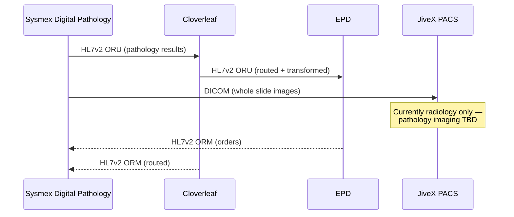
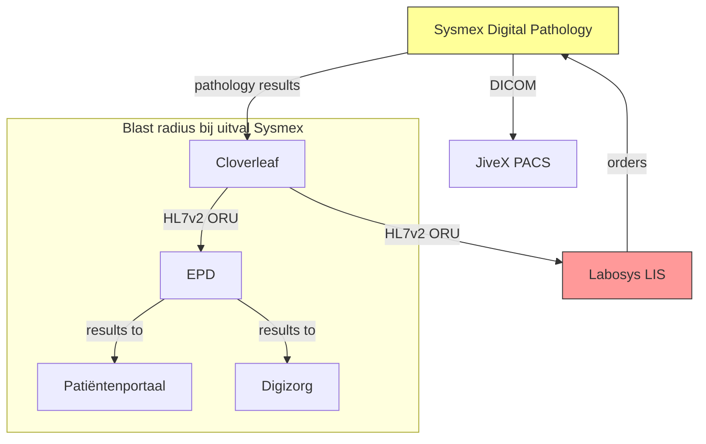

# First-Run Experience

What happens when an architect uses Preflight for the first time. Every moment, from install to "I need this."

---

## Two Entry Points

### Path A: The Architect Who Has a Request Right Now

They have a business request sitting in their inbox. They heard about Preflight. They want to try it. They don't want to set up infrastructure, load knowledge bases, or configure personas. They want to see if this thing works.

### Path B: The New Architect at a New Hospital

Day one at a new job. They used Preflight at their previous hospital. They want to set it up here. They have the hospital's Archi model. They want to be productive immediately.

Both paths converge at the same moment: **the first assessment output.**

---

## Path A: I Have a Request Right Now

### Minute 0 — Start

```
$ preflight
```

No login. No configuration wizard. No "let's set up your organization." Preflight starts.

```
Welcome to Preflight.

No Archi model loaded yet. You can still run assessments —
landscape context will be limited until you load one.

Paste a business request, or type 'setup' for full configuration.

>
```

The architect pastes:

```
> We want Digital Pathology from Sysmex. Whole slide imaging
  for tissue samples. The pathologists are ready to go digital.
```

### Minute 0:30 — Classification

```
Classifying...

  Type:     clinical-system
  Impact:   high
  Triggers: patient data (tissue samples, pathology reports)

  Personas selected (18 + Red Team):
  CIO, CMIO, Marcus, Marco, Sophie, Joris, Thomas, Lena, Daan,
  Jan, Ruben, Aisha, Victor, CISO, ISO-Officer, Nadia, FG-DPO,
  PO, Raven (high impact)

  Mode: deep (high impact → per-persona assessment)

  ⚠ No Archi model loaded — landscape queries skipped.
    Run 'preflight setup --archi <path>' to enable.

  ⚠ No TOPdesk configured — CMDB queries skipped.
  ⚠ No knowledge base indexed — regulatory retrieval limited.

Proceed with available context? [Y/n]
```

This is important. Preflight doesn't block. It tells you what it's missing and proceeds anyway. The architect sees immediately: with Archi loaded, this would be better. But they can try it now.

```
> Y
```

### Minutes 1-3 — Assessment Running

```
Running deep assessment (13 personas)...

  [████████░░] CIO assessing...
  [██████████] CMIO: CONDITIONAL — IVDR classification needed,
               clinical validation required
  [██████████] Marcus: CONDITIONAL — ZiRA positioning: Zorg >
               Diagnostiek. Evaluate JiveX extension first.
  [████████░░] Thomas assessing...
  [██████████] Victor: CONDITIONAL — STRIDE draft generated,
               NEN 7510 compliance required
  ...
```

Real-time progress. Each persona reports as it completes. The architect is watching their board meeting being prepared in real time.

### Minute 3 — Output

```
Assessment complete.

  Triage: STANDARD REVIEW (clinical-system floor applied)
  BIV:    3-3-3 (high across all dimensions)

  Products generated:
    1. PSA draft            → preflight-output/psa-digital-pathology.md
    2. ADR draft            → preflight-output/adr-digital-pathology.md
    3. Clinical Impact      → preflight-output/clinical-digital-pathology.md
    4. Process Impact       → preflight-output/process-digital-pathology.md
    5. DPIA draft           → preflight-output/dpia-digital-pathology.md
    6. BIA/BIV              → preflight-output/bia-digital-pathology.md
    7. Integration Design   → preflight-output/integration-digital-pathology.md
    8. Network Impact       → preflight-output/network-digital-pathology.md
    9. Security (STRIDE)    → preflight-output/security-digital-pathology.md
   10. NFR Specification    → preflight-output/nfr-digital-pathology.md
   11. Vendor Assessment    → preflight-output/vendor-sysmex.md
   12. Operational Readiness→ preflight-output/ops-digital-pathology.md
   13. Tech Radar Update    → preflight-output/techradar-sysmex.md

  Diagrams generated:
   10. Integration flow     → preflight-output/diagrams/integration-flow.mmd
   11. Cascade dependencies → preflight-output/diagrams/cascade.mmd
   12. Landscape position   → preflight-output/diagrams/landscape.drawio
   13. Data flow (DPIA)     → preflight-output/diagrams/data-flow.mmd
   14. STRIDE attack surface→ preflight-output/diagrams/stride.mmd

  Quick view:

  ┌─────────────────────────────────────────────────────────┐
  │ Digitale Pathologie (Sysmex) — STANDAARD REVIEW         │
  │                                                         │
  │ ZiRA: Zorg > Diagnostiek > Diagnostische dienstverlening│
  │ BIV:  B=3  I=3  V=3                                    │
  │                                                         │
  │ Conditions for approval (10):                           │
  │  1. Evaluate JiveX extension (Marcus, Thomas)           │
  │  2. Clinical validation studies (CMIO)                  │
  │  3. IVDR classification (Nadia, CMIO)                   │
  │  4. STRIDE threat model (Victor)                        │
  │  5. AIVG checklist with vendor (Nadia)                  │
  │  6. DPIA before go-live (FG-DPO)                        │
  │  7. Verwerkersovereenkomst (FG-DPO)                     │
  │  8. TCO including storage (CIO)                         │
  │  9. Fallback procedure (CMIO, Jan)                      │
  │ 10. Amend ADR-2023-041 if separate platform (Marcus)    │
  │                                                         │
  │ Open questions for the board (4):                       │
  │  • Budget: digital diagnostics envelope or new funding? │
  │  • Timing: JiveX evaluation parallel or sequential?     │
  │  • Adoption: all pathologists committed?                │
  │  • Strategy: single platform or best-of-breed?          │
  │                                                         │
  │ Red Team (Raven):                                       │
  │  ⚠ Storage cost explosion: 15-45 TB/year, 20yr retain  │
  │  ⚠ Pathologist adoption: 1 of 8 requested, 7 unknown   │
  │  ⚠ Transition period: dual workflow 6-12 months         │
  └─────────────────────────────────────────────────────────┘

Open PSA draft? [Y/n]
```

### Minute 3:30 — The Moment

The architect opens `psa-digital-pathology.md`. They see:

- A managementsamenvatting they could paste into a board email right now
- ZiRA positioning they would have spent half a day researching
- Domain assessments from 13 perspectives they would have gathered over 2 weeks of meetings
- A risk register with 6 items, sourced from named personas
- An AIVG checklist already started — they'd normally forget half these items
- A STRIDE threat model pre-filled — they'd normally skip this entirely
- A DPIA draft with verwerkingsregister entry — the FG would normally wait weeks for this

And the diagrams. The architect opens `diagrams/integration-flow.mmd`:



They didn't draw this. Lena's assessment identified the integration pattern, and Preflight rendered it. The architect opens `diagrams/cascade.mmd`:



Seven downstream consumers. The pathology results flow through Cloverleaf to the EPD, from there to the patient portal and Digizorg. If Sysmex goes down, patients can't see their results. The architect would have spent half a day drawing this on a whiteboard. Preflight generated it from the ArchiMate model in seconds.

And the landscape view — `diagrams/landscape.drawio`:

This one opens in draw.io. It shows the proposal positioned in the hospital's application landscape: Sysmex Digital Pathology as a new node, connected to the existing systems (Labosys, Cloverleaf, JiveX, EPD), with the proposed relationships drawn and the existing relationships visible for context. The architect can edit it — move boxes, add annotations, adjust for the board presentation. It's a starting point, not a final diagram.

**This is the moment.** Not "interesting." Not "let me evaluate this further." The architect is holding a document that would have taken them 3-6 weeks, generated in 3 minutes. With diagrams they can present to the board without redrawing.

It's not perfect. The landscape context is missing (no Archi model loaded). Some findings are generic without hospital-specific knowledge. But it's 70% there, and the architect can see exactly what loading their Archi model would add.

```
> preflight setup --archi ~/Documents/Hospital-Architecture.archimate
```

```
Loading ArchiMate model...
  Found: 847 elements, 1,243 relationships
  Business layer: 203 elements
  Application layer: 312 elements
  Technology layer: 198 elements
  Other: 134 elements

Indexing for persona queries... done (12 seconds)

Your Archi model is loaded. Re-run the last assessment
to include landscape context? [Y/n]
```

```
> Y
```

### Minute 5 — The Better Moment

The second run takes the same 3 minutes. But now the output is different:

```
  ┌─────────────────────────────────────────────────────────┐
  │ NEW with Archi model:                                   │
  │                                                         │
  │ Thomas found:                                           │
  │  • Labosys (LIS) — pathology module, lifecycle: HOLD    │
  │  • JiveX PACS — strategic imaging (ADR-2023-041)        │
  │  → Portfolio overlap: 2 existing systems in diagnostics │
  │                                                         │
  │ Lena found:                                             │
  │  • 14 HL7v2 interfaces through Cloverleaf in diagnostics│
  │  • No FHIR endpoints in pathology                       │
  │  • DICOM connections to JiveX (radiology only)          │
  │  → Cascade: 7 downstream consumers of pathology results │
  │                                                         │
  │ Marcus found:                                           │
  │  • ADR-2023-041: JiveX designated as strategic PACS     │
  │  → Adding Sysmex contradicts existing ADR               │
  │                                                         │
  │ Victor found:                                           │
  │  • Open finding: Labosys on end-of-support OS           │
  │  → Risk extends to Sysmex during transition             │
  └─────────────────────────────────────────────────────────┘
```

Thomas found the portfolio overlap the architect might have missed. Lena mapped the cascade dependencies automatically. Marcus caught the ADR contradiction. Victor found a security risk from TOPdesk that nobody remembered.

**The architect didn't ask for any of this.** The personas asked what they always ask, and the Archi model had the answers.

This is when the architect loads their next request.

---

## Path B: New Hospital, Day One

### Setup (10 minutes)

```
$ preflight setup
```

```
Preflight Setup

Let's get you productive. Three things make Preflight useful:

  1. ArchiMate model  — your application landscape
     (Required for landscape queries. Everything else works without it.)

  2. Hospital config   — ZiRA mapping, tech radar, local principles
     (Optional. Defaults to ZiRA v1.4 standard. Customize later.)

  3. Integrations      — TOPdesk, SharePoint, LeanIX
     (Optional. Add when ready. Preflight works without them.)

Load ArchiMate model? Path or URL:
> ~/Documents/Hospital-Architecture.archimate
```

```
Loading ArchiMate model...
  Found: 847 elements, 1,243 relationships
  Indexing... done (12 seconds)

Hospital configuration:
  ZiRA version: v1.4 (default) [change? n]
  Language: NL (default) [change? n]
  
  Tech radar: not loaded
    → You can load it later: preflight config --tech-radar <path>
    → Thomas will assess without radar context until loaded.

  Knowledge base: ZiRA + regulatory standards (built-in)
    → Hospital-specific policies can be added later:
      preflight knowledge add <path-or-folder>

Setup complete. Ready to assess.

Quick start:
  preflight assess              — paste a request interactively
  preflight assess --file <f>   — assess from a file
  preflight scan "description"  — 30-second quick scan
  preflight history             — view past assessments
  preflight help                — full command reference
```

**What just happened in 10 minutes:**
- The architect has a working EA assessment tool
- It knows their hospital's application landscape (847 elements, 1,243 relationships)
- It has ZiRA built-in (no separate download, no knowledge base creation)
- Regulatory knowledge (NEN 7510, AIVG, AVG, NIS2) is built-in
- They can run their first assessment immediately

**What they DON'T need to do:**
- No GPU setup (uses Ollama locally or configured API endpoint)
- No vector database setup (pgvector in embedded SQLite for Phase 1, or configured PostgreSQL)
- No persona configuration (20 core personas loaded by default)
- No authentication setup (single-user CLI mode, auth added when deployed as service)
- No knowledge base curation (built-in regulatory corpus, hospital-specific added incrementally)

### First Assessment (same as Path A, but with landscape context from the start)

The new architect runs their first request. The output includes landscape context their colleagues have been maintaining in Archi for years. In their first assessment, they demonstrate knowledge of the hospital's application landscape that would normally take months to build.

Their manager sees the PSA draft and asks: "How did you know about the Labosys retirement plan and the JiveX ADR? You've been here one day."

**That's the moment the architect becomes a Preflight evangelist.**

### Day 1, Afternoon: "I Have a Folder Full of Docs"

Every architect has it. A folder — or a SharePoint site, or a OneDrive directory — full of vendor PDFs, data sheets, architecture policies, board decisions, meeting notes, contracts, standards documents. Accumulated over years. Never organized. Invaluable.

```
$ preflight ingest ~/Documents/EA-Docs/

Scanning folder...
  Found: 147 files
    PDF:   62  (vendor docs, policies, standards)
    DOCX:  41  (board decisions, meeting notes, assessments)
    PPTX:  18  (architecture presentations, vendor pitches)
    XLSX:  12  (comparison matrices, pricing sheets, tech radar)
    Other: 14  (images, .msg, .zip — skipped)

  Estimated time: ~4 minutes

Ingest now? [Y/n]
> Y

Ingesting...
  [████░░░░░░]  38/133 files
  
  Parsed:   NEN-7510-controls.pdf → regulatory/nen
  Parsed:   Sysmex-Digital-Pathology-Datasheet.pdf → vendor/sysmex
  Parsed:   Board-Decision-2024-03-PACS.docx → decisions
  Parsed:   AIVG-2022-Module-ICT.pdf → regulatory/procurement
  Parsed:   Tech-Radar-Q1-2025.xlsx → hospital/tech-radar
  ...
  
  ⚠ 3 files could not be parsed:
    Scan-2019-handwritten.pdf — OCR failed (configure Azure AI for scanned docs)
    Legacy-diagram.vsd — Visio format not supported
    Budget-2024.xlsm — macro-enabled Excel, treating as plain xlsx

Ingestion complete.
  133 files parsed → 2,847 chunks indexed
  
  Auto-classified:
    Regulatory:    24 files (NEN, AVG, AIVG, ISO standards)
    Vendor:        38 files (data sheets, contracts, proposals)
    Hospital:      29 files (policies, principles, standards)
    Decisions:     19 files (board decisions, ADRs, meeting notes)
    Architecture:  23 files (diagrams, assessments, reference docs)

  Persona relevance tagged:
    Victor:  312 chunks (security policies, NEN 7510, pen test reports)
    Nadia:   287 chunks (AIVG contracts, regulatory docs, risk assessments)
    Thomas:  198 chunks (vendor data sheets, tech radar, portfolio reviews)
    Marcus:  241 chunks (ADRs, board decisions, reference architectures)
    CMIO:    156 chunks (clinical system docs, FHIR specs, MDR docs)
    ...

  Your next assessment will use this knowledge.
  Thomas will cite your tech radar. Nadia will reference your AIVG contracts.
  Victor will know about last year's pen test findings.
```

**What just happened:** The architect pointed Preflight at a folder. Preflight:

1. **Detected file types** and routed each to the right parser (complex PDF → OpenDataLoader-PDF, simple PDF → PyMuPDF, DOCX → MarkItDown, XLSX → tabular chunker)
2. **Auto-classified** each document by content — regulatory, vendor, hospital policy, board decision, architecture doc
3. **Tagged persona relevance** — which chunks should Victor see vs. Nadia vs. Thomas
4. **Indexed everything** for per-persona retrieval

No manual curation. No tagging. No folder structure requirements. Drop a folder, get a knowledge base.

**The progressive improvement:** Before ingestion, Victor's security assessment was based on generic NEN 7510 knowledge. After ingestion, Victor references the hospital's actual pen test report from last quarter and the specific NEN 7510 controls flagged in the last audit. Nadia cites the actual AIVG contract template the hospital uses, not the generic AIVG text. Thomas knows the tech radar positions because the radar spreadsheet is indexed.

```
$ preflight ingest --watch ~/Documents/EA-Docs/

Watching folder for changes. New/modified files will be auto-ingested.
Press Ctrl+C to stop.
```

The `--watch` flag keeps the knowledge base current. When someone drops a new vendor PDF into the folder, it's indexed automatically. When the tech radar spreadsheet is updated, Thomas's next assessment uses the new positions.

**SharePoint/OneDrive ingestion** (when Graph is configured):

```
$ preflight ingest --sharepoint "Architecture Team/Policies"
$ preflight ingest --onedrive "Vendor Assessments/2025"
```

Same experience, different source. The architect doesn't curate — Preflight classifies, tags, and indexes.

### Day 2-5: Building Institutional Knowledge

```
$ preflight assess --file request-scheduling-system.txt
$ preflight assess --file request-patient-portal.txt  
$ preflight assess --file request-lab-upgrade.txt
```

Each assessment:
- Adds to the vendor intelligence database
- Adds to the assessment history (similar past assessments)
- Identifies architecture debt (linked to ArchiMate elements)
- Builds the hospital's regulatory compliance profile

By Friday, the architect has run 5 assessments. Preflight now knows:
- 3 vendors and their compliance status
- 5 architectural decisions with rationale
- 8 conditions being tracked
- 4 architecture debt items linked to the capability model

The next assessment is better than the first because it has context from the previous five.

### Week 2: The Colleagues Notice

The architect presents a PSA at the board meeting. It's the most thorough assessment the board has seen from someone in their second week. The ZiRA positioning is correct. The principetoets covers all 12 principles. Victor's STRIDE threat model is pre-filled. Nadia's AIVG checklist is already started.

The other architects ask: "What tool is that?"

```
$ preflight setup --archi ~/Documents/Hospital-Architecture.archimate
```

It takes 10 minutes. They run their first assessment. The cycle begins.

---

## The Progressive Disclosure Model

Preflight reveals complexity only when you need it. The first run is simple. Each subsequent interaction adds one capability.

| Interaction | What's Revealed | Trigger |
|-------------|----------------|---------|
| First run | Paste request → get PSA | Just using it |
| Load Archi model | Landscape context in output | `preflight setup --archi` |
| Ingest a doc folder | All personas grounded in your actual policies, standards, vendor docs | `preflight ingest <folder>` |
| Watch a folder | Knowledge base stays current as docs change | `preflight ingest --watch` |
| Load Archi model (diagrams) | Auto-generated landscape, cascade, and integration diagrams | Archi model + assessment |
| Load tech radar | Thomas includes radar positions | `preflight config --tech-radar` |
| Add knowledge | Hospital-specific policies in retrieval | `preflight knowledge add` |
| Configure TOPdesk | CMDB context, open risks, DR status | `preflight config --topdesk` |
| Configure Graph | SharePoint policies, OneDrive vendor docs | `preflight config --graph` |
| Configure LeanIX | Portfolio lifecycle, business criticality | `preflight config --leanix` |
| Deploy as service | Multi-user, auth, audit trail, frontend | `preflight deploy` |
| Add board members | Board prep packs, decision recording | RBAC roles |
| Add requestors | Self-service intake portal | RBAC roles |

Each step is optional. Each step makes the output better. The architect sees the improvement immediately because the output tells them what's missing:

```
⚠ No TOPdesk configured — Victor assessed without open security risks.
  Run 'preflight config --topdesk' to enable.
```

They add TOPdesk. Next assessment, Victor finds an open finding they didn't know about. They never disable TOPdesk integration again.

---

## The CLI Experience (Phase 1)

Phase 1 is CLI-only. No frontend. This is intentional — it matches how architects work (text editors, terminals, Markdown) and avoids the 4-month frontend build before anyone can use the tool.

### Core Commands

```
preflight assess                    Interactive: paste request, get assessment
preflight assess --file <path>      Assess from file
preflight assess --attach <docs>    Attach vendor docs / data sheets
preflight scan "description"        30-second quick scan (fast-track check)
preflight ingest <folder>           Ingest all docs from a folder
preflight ingest --watch <folder>   Watch folder, auto-ingest new/changed files
preflight ingest --sharepoint <p>   Ingest from SharePoint (requires Graph config)
preflight ingest --onedrive <path>  Ingest from OneDrive (requires Graph config)
preflight ingest --status           Show what's indexed, freshness, chunk counts
preflight history                   List past assessments
preflight history show <id>         View a past assessment
preflight diff <id1> <id2>          Compare two assessments (delta)
preflight conditions                List open conditions across all assessments
preflight conditions <id>           Conditions for a specific assessment
preflight vendors                   Vendor intelligence profiles
preflight debt                      Architecture debt register
preflight cascade --system <name>   Blast radius for any system (always current)
preflight registry                  Information ownership registry
preflight verwerkingsregister       Cumulative processing activities register
preflight patterns                  Solution pattern library
preflight kpis                      Architecture KPIs dashboard
preflight query "question"          Natural language query over all data
```

### Configuration Commands

```
preflight setup                     Interactive setup wizard
preflight setup --archi <path>      Load ArchiMate model
preflight config --tech-radar <p>   Load tech radar
preflight config --topdesk <url>    Configure TOPdesk integration
preflight config --graph            Configure Microsoft Graph
preflight config --leanix <url>     Configure LeanIX integration
preflight config --llm <endpoint>   Configure LLM endpoint (default: local Ollama)
preflight knowledge add <path>      Add hospital-specific knowledge
preflight knowledge list            List indexed knowledge
preflight knowledge refresh         Re-index all knowledge
```

### Output Control

```
preflight assess --lang nl          Output in Dutch (default)
preflight assess --lang en          Output in English
preflight assess --mode fast        Force fast mode (batched)
preflight assess --mode deep        Force deep mode (per-persona)
preflight assess --products psa,bia Generate specific products only
preflight assess --personas 5       Limit to top-5 most relevant personas
preflight assess --format md        Markdown output (default)
preflight assess --format json      Structured JSON output
preflight assess --diagrams         Generate diagrams (default: on)
preflight assess --no-diagrams      Skip diagram generation
```

### Diagram Commands

```
preflight diagram <assessment-id>            Regenerate diagrams for an assessment
preflight diagram --type cascade <id>        Specific diagram type
preflight diagram --format mermaid <id>      Mermaid output (default, embeds in Markdown)
preflight diagram --format drawio <id>       draw.io XML (editable in draw.io/diagrams.net)
preflight diagram --format both <id>         Both formats
preflight diagram --open <id>                Generate and open in default viewer
```

### Example Session

```
$ preflight scan "SaaS tool for employee satisfaction surveys, 
  no patient data, 50 users, €5k/year"

Quick Scan Result:
  Type:   new-application (low impact)
  Status: Fast-track candidate
  Note:   No patient data, no clinical workflow, low integration complexity.
          Full Preflight assessment optional.
          Estimated full assessment: ~1 minute (fast mode, 6 personas).

Run full assessment? [y/N]
$ n

$ preflight assess
Paste your request (end with empty line):
> AI-powered radiology triage system from MedTech startup.
> Prioritizes imaging studies by clinical urgency.
> Cloud-hosted, FHIR API, integrates with JiveX PACS.
>

Classifying...
  Type:     clinical-system + ai-ml (critical impact)
  Triggers: patient data, clinical decision support, EU AI Act
  Mode:     deep (critical impact, 2 interaction rounds)
  Personas: 13 + Red Team

  ⚠ This is a clinical AI system. Cannot be fast-tracked.
  ⚠ EU AI Act: likely high-risk (clinical decision support).
  ⚠ MDR/SaMD: software influencing clinical decisions.

Running deep assessment with interaction rounds...
```

---

## What Makes This Stick

### Immediate value, zero setup
Paste a sentence, get a draft PSA. No infrastructure, no configuration, no training. The architect's existing workflow (receive request → research → write PSA) is accelerated, not replaced.

### Gets better the more you use it
Each assessment builds institutional knowledge. Assessment 50 is dramatically better than assessment 1 because Preflight has 49 assessments of vendor profiles, architectural decisions, regulatory determinations, and landscape context to draw from.

### Gets better the more you configure
Each integration adds one more source of context. The architect sees the gap ("no TOPdesk configured") and the improvement when they close it ("Victor found an open security finding you didn't know about"). The improvement is immediate and visible.

### Protects you
The architect who uses Preflight never gets blindsided at the board meeting. Victor's STRIDE is pre-filled. Nadia's AIVG checklist is started. The FG's verwerkingsgrondslag question is already answered. Every gap that usually surfaces mid-meeting is surfaced before the meeting.

### Makes you look good
The new architect presents a thorough PSA in their second week. The senior architect frees up 3 days per assessment for strategic work. The CIO's board prep pack is generated automatically. Everyone who uses Preflight produces better output with less effort.

### You take it with you
When you move to a new hospital, you `preflight setup --archi` with the new model, and you're productive on day one. The tool is yours. The knowledge base rebuilds from your new hospital's landscape. The personas are the same everywhere — ZiRA is the same everywhere. Your skill transfers.

---

## Diagram Generation (Mermaid + draw.io)

Architects think visually. Preflight has the data — ArchiMate relationships, data flows, cascade dependencies, persona findings — and renders it as diagrams the architect can present or edit.

### What Gets Generated

Every assessment auto-generates diagrams relevant to the proposal. Not all diagrams for every assessment — only the ones that add value.

| Diagram | Format | When Generated | Source Data |
|---------|--------|---------------|-------------|
| **Integration flow** | Mermaid sequence | Integration design product generated | Lena's assessment + ArchiMate interfaces |
| **Cascade dependencies** | Mermaid flowchart | BIA product generated | ArchiMate serving/flow relationships (multi-hop) |
| **Landscape position** | draw.io | Archi model loaded | Proposal placed in existing application landscape |
| **Data flow** | Mermaid flowchart | DPIA product generated | Aisha's data classification + ArchiMate data objects |
| **STRIDE attack surface** | Mermaid flowchart | Security product generated | Victor's STRIDE findings + system boundaries |
| **BIV impact** | Mermaid flowchart | BIA with any dimension = 3 | ZiRA process → system mapping with impact scores |
| **Deployment** | draw.io | Infrastructure assessment needed | Jan's assessment + ArchiMate technology layer |

### Two Formats, Two Purposes

**Mermaid** — embedded directly in the Markdown output. The architect opens the PSA and sees the diagrams inline. Renders in any Markdown viewer, GitHub, GitLab, Obsidian, VS Code. No separate tool needed. The source is text, so it's version-controlled and diffable.


**draw.io** — for diagrams the architect needs to edit, annotate, or present in a specific layout. The landscape position diagram puts the proposal in context of the full application landscape — that needs human layout. The deployment diagram needs the architect's knowledge of network zones. draw.io files open in diagrams.net (free, browser-based) or the desktop app. The architect drags, annotates, and exports to PNG/SVG for the board deck.

### How It Works (MCP Integration)

Preflight uses MCP (Model Context Protocol) servers for diagram generation:

- **Mermaid MCP**: takes structured data from persona assessments + ArchiMate relationships → generates Mermaid diagram source → embeds in Markdown output
- **draw.io MCP**: takes ArchiMate model elements + proposed system → generates draw.io XML with the proposal positioned in the existing landscape → saves as `.drawio` file

The LLM doesn't draw the diagram — it generates the structured description (nodes, edges, relationships) from the assessment data. The MCP server renders it. This means:

- Diagrams are **grounded in actual data**, not hallucinated layouts
- ArchiMate elements keep their IDs — the draw.io diagram links back to the Archi model
- Cascade analysis follows real `serving`/`flow`/`triggering` relationships, not guessed connections
- Integration flows use actual HL7v2/FHIR/DICOM interfaces from the model

### Diagrams in the Worked Example

For the Digital Pathology assessment, Preflight generates:

1. **Integration flow** (Mermaid sequence): Sysmex → Cloverleaf → EPD, Sysmex → JiveX PACS, with HL7v2/DICOM protocols labeled
2. **Cascade dependencies** (Mermaid flowchart): 7 downstream systems affected if Sysmex is unavailable, with blast radius highlighted
3. **Landscape position** (draw.io): Sysmex as new node in the diagnostics capability area, connected to Labosys (to be retired), Cloverleaf, JiveX, EPD — architect can rearrange for the board presentation
4. **Data flow for DPIA** (Mermaid): tissue images (bijzondere persoonsgegevens) flowing from scanner → Sysmex → PACS → EPD → patient portal, with classification labels at each node
5. **STRIDE attack surface** (Mermaid): system boundaries, trust zones, data flows with threat categories marked

The architect walks into the board meeting with 5 diagrams they didn't draw. They edit the landscape view in draw.io, add an annotation ("ADR-2023-041 conflict — evaluate JiveX first"), and export to PNG for the board deck. Total effort: 10 minutes of editing vs. 4 hours of drawing from scratch.

---

## Anti-Patterns to Avoid

### Don't require setup before first use
If the architect has to configure anything before their first assessment, 50% will quit. Let them paste a request immediately. Show them what's missing in the output, not in a setup wizard.

### Don't show the pipeline
The architect doesn't need to see "Step 0: Ingest... Step 1: Classify... Step 2: Retrieve..." They paste a request and get output. The pipeline is internal. Show progress ("CMIO assessing... Victor assessing...") because that's interesting. Don't show architecture.

### Don't dump all 20 personas on the first run
For a simple SaaS request, 6 personas are relevant. Don't show the architect 15 assessments when 9 of them say "N/A — not relevant to this request." `selectRelevant()` exists for a reason. The output should feel focused, not exhaustive.

### Don't require authentication for single-user CLI
Phase 1 is a CLI tool on the architect's laptop. They authenticated when they logged into their computer. Don't add Entra ID before the tool proves its value. Auth comes in Phase 2 when it becomes a shared service.

### Don't generate perfect output
70% is the target. If the output is 95% perfect, the architect rubber-stamps it. If it's 70%, they read it, improve it, and own it. The imperfection is a feature — it keeps the human in the loop.

---

*The best product experience is the one that makes the user forget they're using a product. Preflight should feel like having a very fast, very thorough junior analyst who already read all the documentation.*
